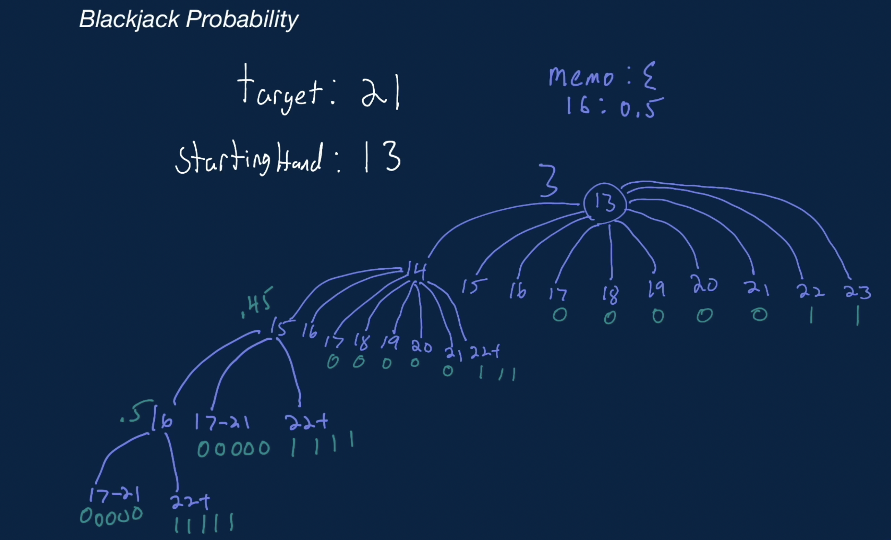

Blackjack Probability

In the game of Blackjack, the dealer must draw cards until the sum of the values of their cards is greater than or equal to a target value minus 4. For example, traditional Blackjack uses a target value of 21, so the dealer must draw cards until their total is greater than or equal to 17, at which point they stop drawing cards (they "stand"). If the dealer draws a card that brings their total above the target (above 21 in traditional Blackjack), they lose (they "bust").

Naturally, when a dealer is drawing cards, they can either end up standing or busting, and this is entirely up to the luck of their draw.
Write a function that takes in a target value as well as a dealer's startingHand value and returns the probability that the dealer will bust (go over the target value before standing). The target value will always be a positive integer, and the startingHand value will always be a positive integer that's smaller than or equal to the target value.

For simplicity, you can assume that the dealer has an infinite deck of cards and that each card has a value between 1 and 10 inclusive. The likelihood of drawing a card of any value is always the same, regardless of previous draws.
Your solution should be rounded to 3 decimal places and to the nearest value. For example, a probability of 0.314159 would be rounded to 0.314, while a probability of 0.1337 would be rounded to 0.134 .

Sample Input
target = 21
startingHand = 15

Sample Output
0.45 // Drawing a 2-6 would result in the dealer standing.
// Drawing a 7-10 would result in the dealer busting.
// Drawing a 1 would result in a 16, meaning the dealer keeps drawing.
// Drawing with a 16 results in a 0.5 probability of busting (6-10 all result in busts).
// The overall probability of busting is 0.4 + (0.1 * 0.5)
// (the probability of busting on the first draw + the probability of busting on the second).

