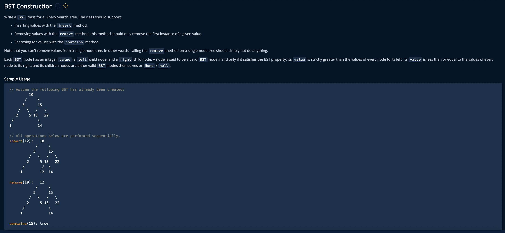

Lets learn

Binary Tree -- BT

Think of BT as a family
* where every person is called a NODE and that NODE can have UP TO 2 children(left and righ child)

* The first person in the familty is called a ROOT and its where everything starts
* Each node is connected to its children with strings called EDGES

The KEY rule in BT is
"Only upto 2 children are allowed and NO RULES ABOUT TEH ORDER"

      A
     / \
    B   C
   /     \
  D       E

It doesnt care about the order -- B can be smaller than A or bigger -- It doesnt matter

Binary Search Tree -- BST

Now imagine a family with strict rules: thats a BST
* Lest child is ALWAYS smaller than the parent
* Right child is ALWAYS bigger than the parent
* This rule is recursive and applied all the way down

       10
      /  \
     5    15
    / \     \
   2   7     20

5 < 10, So it goes left
15 > 10, So it goes right and so on.

* BST is built for SEARCHING FAST.

Three pillars of BST

1. Insertion: 
when a person arrives 
* Starts at the root node
* Asks "Am i smaller or bigger than the current node?"
* If smaller, the go left else right
* Repeat until you find an EMPTT SPOT and settle there.

2. Search:
Almost same as insertion
* Starts at the root
* Move left or right depending on whether the value is smaller or greater
* If you land on the number, found it
* If you hit None, Its not there.

3. Deletion:
This is the trickiest because we dont want to break the rules. So there are 3 cases

Case 1: if its the leaf node that has to be deleted, then just remove it. No problem.
Case 2: if it has ONE child, then link its child to its parent and delete it.
Case 3: if it has TWO children, 
* Find the smallest number in the RIGHT subtree
* copy that value into the node of the parent
* Delete the duplicate from the right subtree

class BST:
    def __init__(self, value):
        self.value = value
        self.left = None
        self.right = None

    def insert(self, value):
        currentNode = self
        while currentNode is not None:
            if value < currentNode.value:
                if currentNode.left:
                    currentNode = currentNode.left
                else:
                    currentNode.left = BST(value)
                    break
            else:
                if currentNode.right:
                    currentNode = currentNode.right
                else:
                    currentNode.right = BST(value)
                    break
        return self

    def contains(self, value):
        currentNode = self
        while currentNode is not None:
            if value == currentNode.value:
                return True
            elif value < currentNode.value:
                currentNode = currentNode.left
            else:
                currentNode = currentNode.right
        return False

    def remove(self, value, parent=None):
        currentNode = self

        while currentNode is not None:
            if value < currentNode.value:
                parent = currentNode
                currentNode = currentNode.left
            elif value > currentNode.value:
                parent = currentNode
                currentNode = currentNode.right
            else:
                if currentNode.left is not None and currentNode.right is not None:
                    currentNode.value = currentNode.right.getMinValue()
                    currentNode.right.remove(currentNode.value, currentNode)
                elif parent is None:
                    if currentNode.left is not None:
                        currentNode.value = currentNode.left.value
                        currentNode.right = currentNode.left.right
                        currentNode.left = currentNode.left.left
                    elif currentNode.right is not None:
                        currentNode.value = currentNode.right.value
                        currentNode.left = currentNode.right.left
                        currentNode.right = currentNode.right.right
                elif parent.left == currentNode:
                    parent.left = currentNode.left if currentNode.left else currentNode.right
                elif parent.right == currentNode:
                    parent.right = currentNode.left if currentNode.left else currentNode.right
                break
        return self

    def getMinValue(self):
        current = self
        while current.left is not None:
            current = current.left
        return current.value