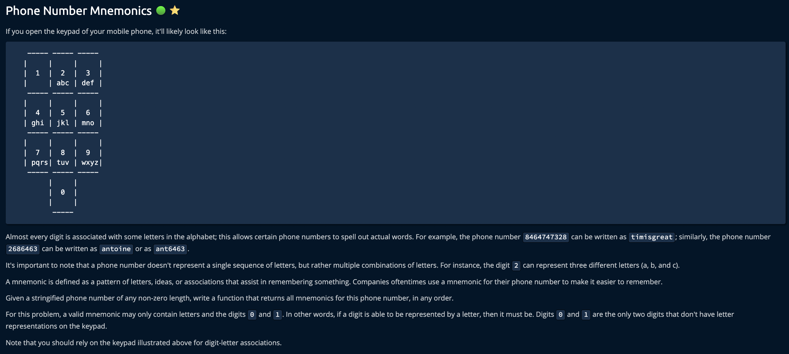

Sample Input
phoneNumber = "1905"

Sample Output
[
"1woj",
"IwOk"
"Iwol"
"1x0j"
"1x0k"
"1x01"
"1y0j"
"1y0k"
"1y0l"
"1z0j",
"12Ok"
"1z0l",
]
// The mnemonics could be ordered differently.

print(updatedRes):
{
  "phoneNumber": "1905"
}

['1']
['1w', '1x', '1y', '1z']
['1w0', '1x0', '1y0', '1z0']
['1w0j', '1w0k', '1w0l', '1x0j', '1x0k', '1x0l', '1y0j', '1y0k', '1y0l', '1z0j', '1z0k', '1z0l']
